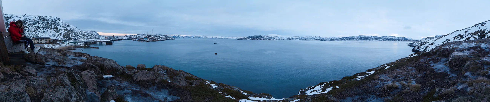
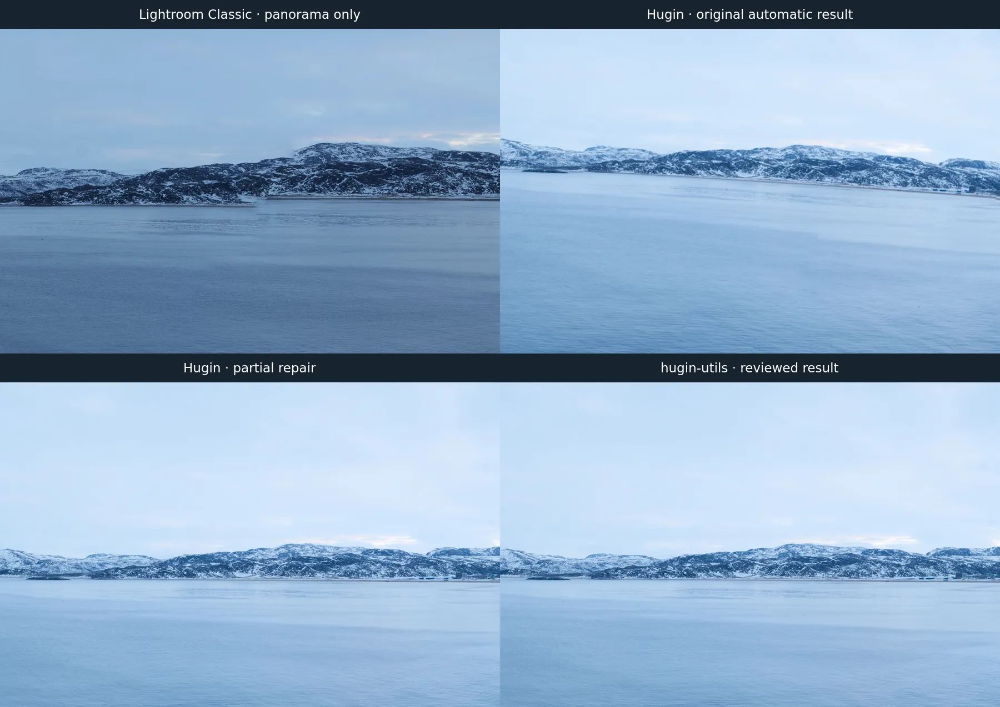
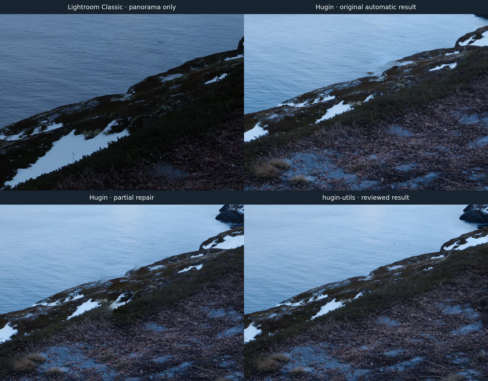

# hugin-utils

Command-line tools for reviewing and repairing visible seams in [Hugin](https://hugin.sourceforge.io/) panoramas. The repository contains Go source code and an optional `SKILL.md` for coding agents. Built executables are not committed.

The tool helps find and review overlap problems; it does not claim that a difference score proves a bad seam or that a mask will fix all parallax.

## Example: Murmansk panorama



The finished panorama was reviewed at full resolution and locally repaired with `hugin-utils splice`. The three images below total less than 700 KB.

### Distant shoreline



The Lightroom Classic version used only its panorama feature, without color grading. It has a small step in the far shoreline. The panels show the same landmark across four versions; their projections and exposure differ.

### Foreground shoreline



The original Hugin render shows a displaced coastline. An intermediate repair still leaves a duplicate edge; the final reviewed result follows one continuous shore. The full panorama and crops are in [`example/`](example/).

Example photographs © 2026 Mulei Zhang. The MIT license covers the software, not these photographs.

## Requirements

- Go 1.22 or newer to build
- ImageMagick 7 (`magick` on `PATH`)
- Hugin command-line tools (`pano_modify`, `nona`, and `pano_trafo`), either installed natively or through the `net.sourceforge.Hugin` Flatpak
- The Flatpak, if used, must have access to the project, source images, and output directory

There are no Go module dependencies. No Python environment is needed.

## Build and test

```sh
go build -o bin/hugin-utils ./cmd/hugin-utils
go test ./...
bin/hugin-utils doctor
```

Alternatively, run the source without building:

```sh
go run ./cmd/hugin-utils help
```

The generated `bin/hugin-utils` is ignored by Git.

## Commands

### Inspect all adjacent overlaps

```sh
bin/hugin-utils audit \
  --pto panorama.pto \
  --pano panorama.jpg \
  --out audit-report
```

Open `audit-report/index.html`. For each adjacent source pair, it contains a board with three sample rows and four columns: source A, source B, stitched panorama, and enhanced source difference. Each card also links to the **complete stitched overlap at native resolution**. Inspect those full crops, including both sides and the foreground. `audit.json` records panel coordinates and a rough source disagreement score.

`--scale 25` controls the temporary remap canvas area as a percentage. The default gives useful overview detail for large panoramas. Small values speed up a diagnostic run but make the sample boards less useful. The native-resolution overlap crops retain their original detail.

### Create a candidate include mask

```sh
bin/hugin-utils mask \
  --pto panorama.pto \
  --image 14 \
  --region 15100,2200,1300,1600 \
  --out panorama-candidate.pto
```

Image numbers are zero-based. The region is `x,y,width,height` in the **cropped panorama JPEG**, not source-image coordinates. Hugin's `pano_trafo` maps it into the selected source image. The command adds a positive mask and writes a new PTO beside the input PTO so its relative source paths remain valid. Choose the source from the audit images, then render and inspect the candidate; a broad mask can move a seam elsewhere.

### Review changes between renders

```sh
bin/hugin-utils compare \
  --before panorama.jpg \
  --after panorama-candidate.jpg \
  --out change-report
```

The two images must have the same dimensions. Open `change-report/index.html` to inspect the most changed regions, side by side. `--top 16` changes the number of regions shown. A large change can be a repair or a regression; inspect it visually.

### Merge a local repair

```sh
bin/hugin-utils splice \
  --base panorama.jpg \
  --candidate panorama-candidate.jpg \
  --region 15100,2050,1700,1850 \
  --feather 30 \
  --out panorama-final.jpg
```

The command uses the candidate inside the region and the base image elsewhere, with a feathered boundary. It writes `panorama-final.jpg.json` with the inputs and settings. Keep both input renders and inspect the entire perimeter at native resolution. A spliced JPEG cannot be reproduced from the candidate PTO alone.

## Limits

- `audit` covers adjacent image pairs. Nonadjacent overlaps and detailed defects between its three sample rows still require inspection of the complete overlap crops.
- Source disagreement is a **triage hint**, not a defect probability. Water movement, exposure, and legitimate parallax can raise it.
- Global alignment cannot remove all near-foreground parallax. The user or agent must select the correct source and review candidate seams.
- Input photos and PTO files are never modified in place.

## Agent skill

`SKILL.md` describes a review workflow for an agent. It is optional; the CLI works on its own.

## License

MIT. See [LICENSE](LICENSE).
